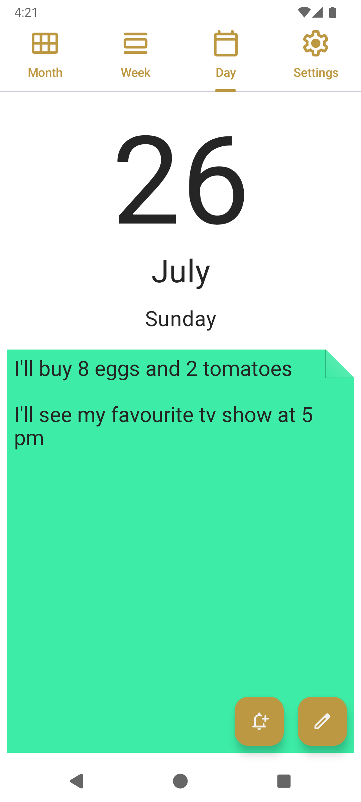
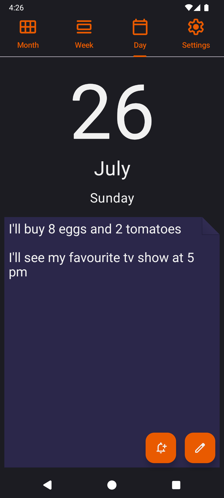
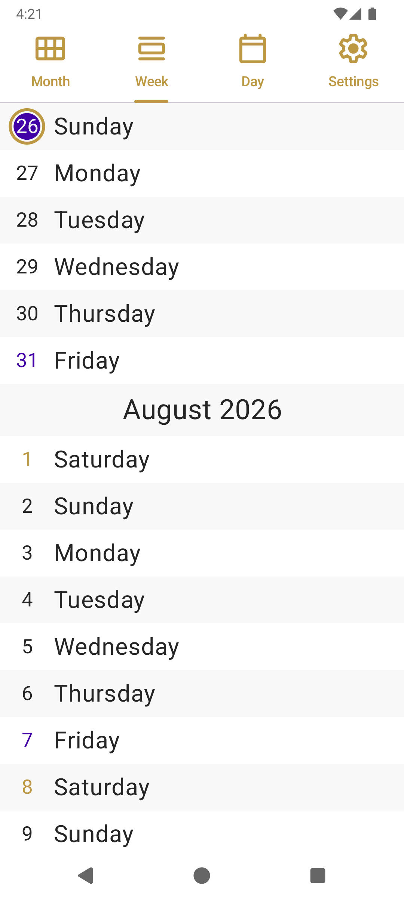
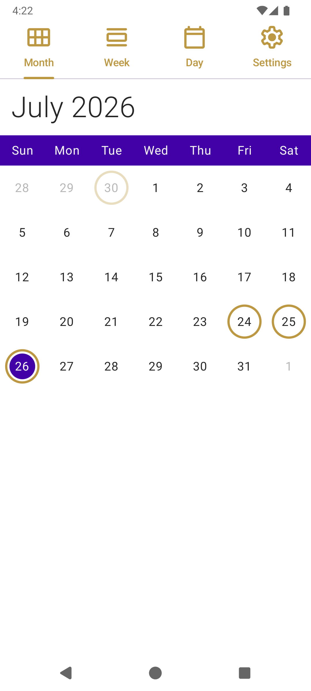
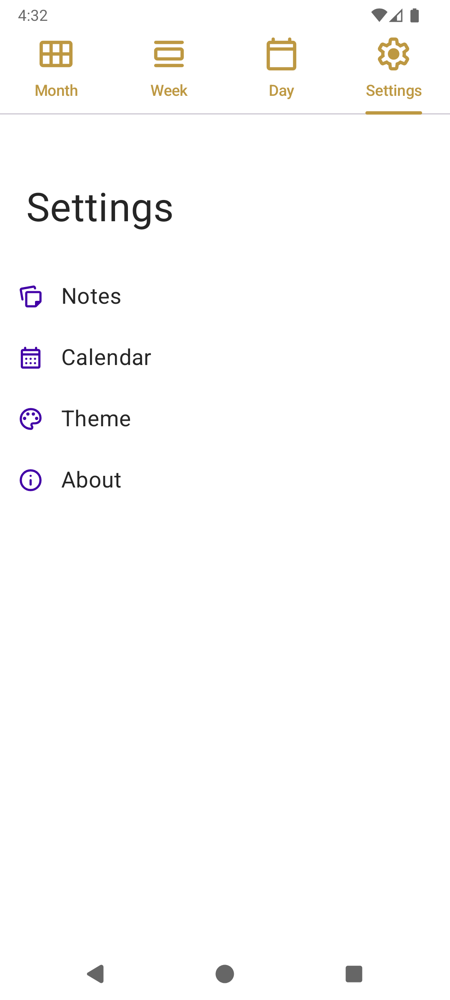
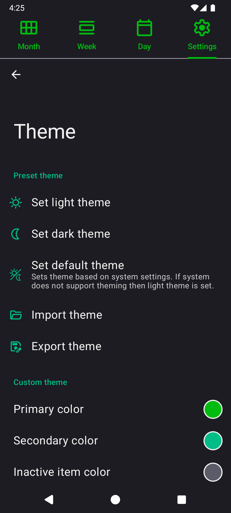

  

<h1 align="center">NoteCalendar</h1>

*Note Calendar* is a simple offline app which allows to manage notes for different days and offers a
quick way to reach each of them.

Minimum Android version: 5.0 (Lollipop, API level 21)

## Screenshots

  

  

  

## Features

* Day screen - this screen is used to add, edit or delete note and set reminder for it.
* Week screen
* Month screen
  * Days that constains a note are marked with a ring
  * Day that is currently selected is marked with a solid circle
  * Today's day is marked with a different color of text
  * Long press on a day's number allow to quickly add or edit note for that day
* Settings screen
  * Notes - notes specific settings, allows to import and export your notes.
  * Calendar - calendar specific settings like first day of the week.
  * Theme - includes light, dark and allows to create your own theme and export it.
  * About - section about the application.

## Translations

You can help with translations on https://hosted.weblate.org/projects/note-calendar/.

### Specific translation strings

`?` - means the translation is optional and is already translated by the Android. You can however
translate it if the automatic translation is not the best fit for your language.

`%s` - is an argument inside string, provided by the application. It can be a thing like number 
or date. You need to keep this argument in your translation.

## License

*NoteCalendar* is licensed under the MIT license.

[More about license](LICENSE)

[Privacy Policy](PRIVACY-POLICY.md)